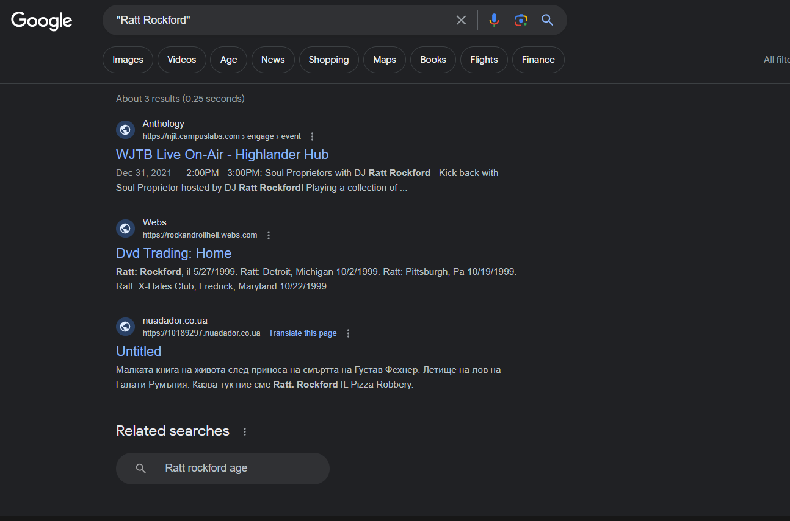

# Breaking JerseyCTF_2023

This gave people a headache, I hear.

With zero solves, I think it's time to explain the process to solving this.

## SimonLettiLog text:

//--//--//--//--//--//
Estimated Date: Unknown
Log: Who's Just The Best??

Anna_was_supposed_to_wait_for_me,_but_I_guess_time_waits_for_nobody._I_tried_to_follow_her,_but_got_kicked_out_of_the_jump_pretty_quickly.

Instead_of_reaching_Grace_at_Vassar_College,_I_ended_up_at_a_nearby_tech_school._I_think_this_was_the_school_where_our_great_grand_Uncle_Ted_founded_NCE_in_the_1960s. 

Not_enough_supplies_to_make_my_own_jump_device,_and_that_AI_right_now_is_laughably_bad._Not_that_ours_is_any_better._I'm_hiding_out_in_the_campus_center_of_the_university_while_I_make_a_plan.

I'm_going_to_try_and_relay_a_message_to_any_intelligence_agents_who_could_help_after_Ratt_Rockford_leaves,_but_I'll_have_to_be_quick.

Can't_risk_this_message_falling_into_the_wrong_hands,_so_hopefully_it_reaches_someone_trustworthy. 

YII1F4OOZ5K4286HHG7JCNTB

//--//--//--//--//--//

Now that we see all of what was included, let's break down this piece by piece:

# Step One: Build your case

We're introduced to another character who appeared in SpringForwardCTF, Simon Letti (Lost in Time!). He went looking for Anna, but got lost, too.

Question: What are we trying to find?
Answer: 

# Step Two: Examine the evidence

The Challenge text itself gives little to go off, but:

1. Title: From wnce they came.
   1. wnce? spelled incorrectly. Mark this.
2. "Keep an ear out"? Maybe nothing, but we might hear a message.

Then, we can look at the log file:

1. Who's Just The Best?
   1. Title, subtle hint and definitely overlooked.
2. Date: Unknown.
3. All words are separated by underscores, not sure why.
4. Location: A tech school.
   1. We know he was trying to follow Anna, and Anna ended up in NYC. 
   2. The tech school should be nearby to NYC.
5. Uncle Ted:
   1. Ted founded NCE in the 1960s.
6. NCE
   1. What's NCE?
7. Specific location: Campus Center of the university he's in.
8. Message to intelligence agents will be sent
9. Ratt Rockford is on air
10. YII1F4OOZ5K4286HHG7JCNTB - Most likely the flag?

# Step Three: Highlight Key notes

We can now look at the notes, and find the most granular information:
1. Ratt Rockford is on air
2. Tech school near to nyc that has "NCE" founded by a "Ted"
3. Must be around when "AI" started popping up (current time)
4. Message is sent in a way that intelligence agents might communicate

# Step Four: Take action on notes

First, let's Google Ratt Rockford:
1. Three results:
   1. 
   2. WJTB Live on Air?
   3. This appears to be connected to NJIT, which was hosting the event and announced multiple times.
   4. This is enough to solve the challenge, but let's continue...
2. Now let's look for a tech school, nce, near nyc.
   1. 
   2. NJIT pops up again.
   3. Note, I'm searching incognito with a vpn.
3. We could also just search NCE tech school
   1. 
4. So now, from these searches we can identify this is most likely at NJIT. If we were unsure from the first search of ratt rockford, we could look up the radio station mentioned in that google search: WJTB
   1. 
5. We are told the message was sent in a way intelligence agents (spies) might communicate or expect to hear a message.
   1. We keep seeing the radio, so let's try a search for 'radio spy communications' (assuming you didn't already know).
   2. 
   3. Okay, so numbers stations.
6. Look up numbers stations:
   1. https://en.wikipedia.org/wiki/Numbers_station
   2. Learn.
   
Okay, so we know we're really looking for a numbers station broadcast, probably from wjtb. We also know the broadcast will go after Ratt Rockford leaves the air. Further, we know that Ratt rockford is a DJ at wjtb, formerly wnce. They listed the schedule on the site. You'll also see how to listen: 

So we see the specific mp3 link, and that Ratt Rockford performed on Wednesdays...  If we take all of this to the wayback machine, and search for specifically the mp3:

1. From 2021 to 2023, there were only a handful of recordings:
   1. 
   2. Only one day lines up with ratt rockford's schedule.
2. If we go listen (https://web.archive.org/web/20230222172707/https://stream.njit.edu:8000/stream1.mp3), we'll hear a strange broadcast on one of the recordings:
   1. Shortly after Ratt Rockford leaves, a strange person hops on
   2. "Attention Travelers 115266871591368741996730" repeats a few times in varying voices followed by "Anna, if you're out there, I hope this reaches you" and ends with Wasted Years by Iron Maiden.
3. How can we decrypt a one-time pad, common in number station broadcasts
   1. https://www.boxentriq.com/code-breaking/one-time-pad
   2. Use the encrypted flag given in the note: 
      1. YII1F4OOZ5K4286HHG7JCNTB
   3. And the key in the broadcast:
      1. 115266871591368741996730
   4. You'll notice that the flag and the key use numbers, and the message had underscores. You'll need to increase the alphabet to included 1234567890_.
   5. Decode:
      1. 

# Step Five: Submit your flag

jctf{0TP_L0ST_AND_C0MPR0MIS3D}