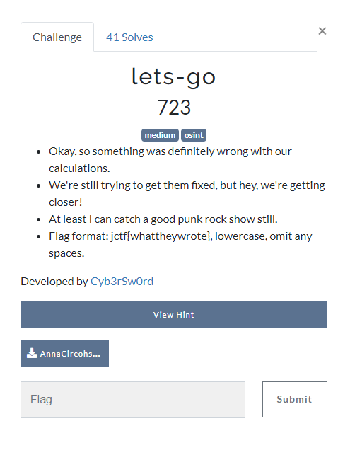
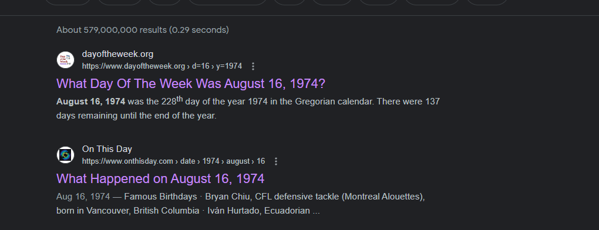
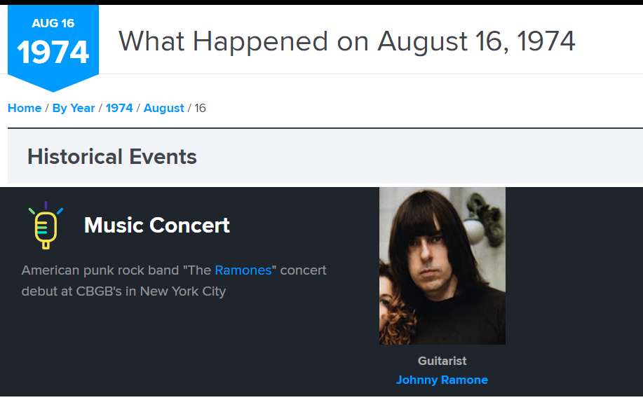
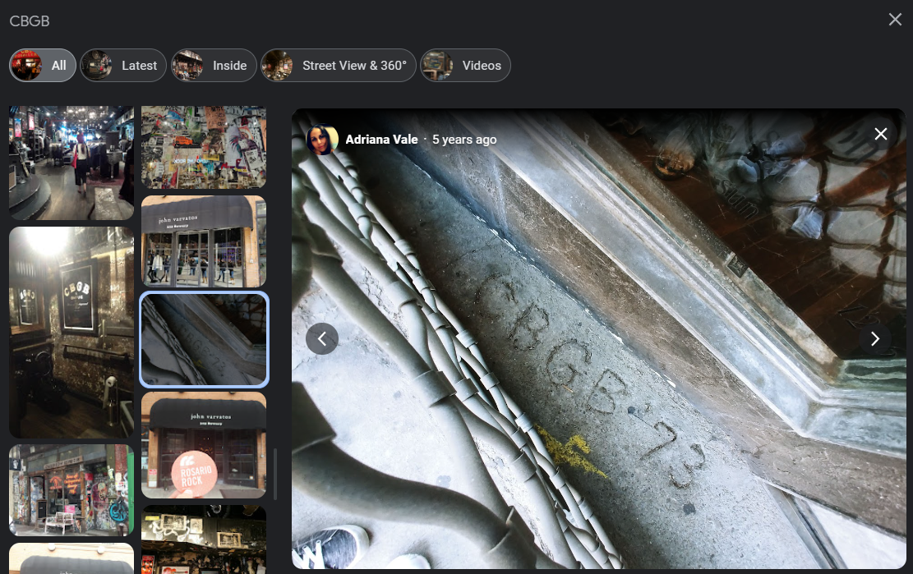
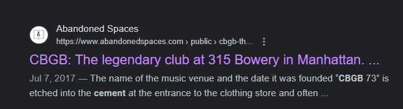

# Breaking JerseyCTF_2023

# let's go!

Okay, so this is the logical next step to off-by-this-much. Anna is still lost, and we don't know where she is.

Let's tackle this one. It's a Medium challenge, so it *should* be harder.

We're given another file, AnnaCircohsLog2.txt, and some more basic info... what can it mean?

## Contents of AnnaCircohsLog2.txt:
//--//--//--//--//--//
Estimated Date: August 16, 1974
Log: Still Rocking

Status update - The supplies we got helped me make a few more adjustments.
Unfortunately, it only took me 40 more years backwards, and still not near Grace Hopper.

Fortunately, if my memory is correct, I can basically get a private concert with my favorite quartet.

Last time I was here was 9 months ago local space-time, before all of the programs began acting up! I wonder if they paved over what HK and I drew in the concrete when they opened up?

//--//--//--//--//--//

# Step One: Build your case

Question: What are we looking for?
Answer: We are looking for something Anna drew in concrete at a bar that opened up around 9 months before August 16th, 1974. 

# Step Two: Examine the evidence

1. Title: Let's go. If you're a punk rock fan, you already solved this challenge. Good on 'ya.
2. First Date: August 16, 1974. The venue opened up at this time.
3. Second Date: 9 months back would be 1973, approximately December 1973. 
4. A concert is going to take place here with a 4-piece band (quartet) that almost nobody attends.
5. Location: Still appears to be NYC
6. The band: will be a punk rock band.

# Step Three: Highlight key notes

The key takeaways from the evidence are:
1. August 16, 1974
2. Punk Rock (4 piece punk band)
3. NYC
4. Let's Go (if they caught it)
5. December 1973

# Step Four: Take action on notes

Use your notes to conduct a search. Start with the most granular, which seems to be 8/16/1974.

1. Google August 16, 1974 or 8/16/1974
   1. 
   2. The first two results will tell you what happened on this day and what day of the week it was... well, we don't care what day of the week it was, right? It was Friday, but that doesn't matter. Let's go to the second link: what happened.
2. Oh, the first think you see when you click that seems important:
   1. 
   2. Not sure who Ramones are? Well, a simple search shows you they're a punk rock band from NYC that debuted to an almost empty CBGBs on 8/16/1974.
3. Now we know the band *and* where they performed. Let's look up CBGBs.
   1. You can find two listings for CBGB. Look at their photos:
   2. 
4. If you missed the picture, Google cbgb nyc concrete:
   1. 

# Step Five: Submit your flag.

Simple, right? we just need to submit: jctf{cbgb1973}

# Extra Notes:

Let's Go: Nod to Ramones.
This is from a month after that performance: https://www.youtube.com/watch?v=pqpM-vN4HMY
December 1973 is when cbgb opened. This was another path to the flag.

