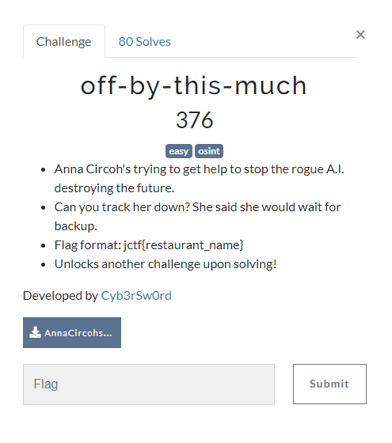
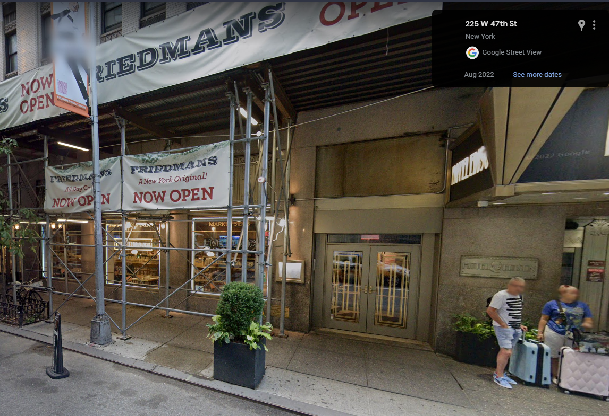
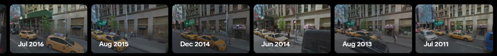
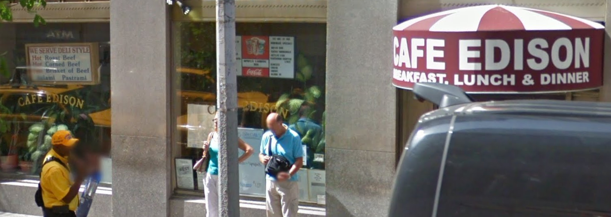

# Breaking JerseyCTF_2023

We're given a file, AnnaCircohsLog1.txt, and some baseline info... What can we make of it?

# Step One: Build your case

Question: What are we looking for?
Answer: A restaurant near where she might be. We want the name of the restaurant. 

Simple enough, right?

# Step Two: Examine the evidence

1. We are looking for a restaurant name.
2. Anna's log states she was looking for Grace Hopper in 1924.
3. Anna also reveals she was 90 years *too late*. This implies the year is approximately 2014.
4. This is clarified by the estimated date: June, 2014.
5. Anna states she is we're 45 seconds from Broadway. This is oddly specific.
6. They have a corned beef sandwich.

# Step Three: Highlight key notes

The key takeaways from the evidence are:
1. Grace Hopper
2. New York
3. 45 Seconds from Broadway
4. Corned Beef

# Step Four: Take action on notes

Use your notes to conduct a search. Start with the most granular, in this case - 45 second from broadway seems very specific.

1. Googling 45 Seconds from Broadway reveals there is a play by Neil Simon
2. The wikipedia reveals this takes place in a coffee shop, inspired by that which was in the Hotel Edison in Manhattan.
3. Googling Hotel Edison, you can look at the street view to see that there is, indeed, a restaurant. However, the date is wrong
   1. 
4. Google let's us time travel:
   1. 
5. Traveling to June 2014, we can see that it is not Friedman's, but Cafe Edison.
   1. 
   2. And they have a Corned Beef Sandwich.

# Step Five: Submit your flag.

Simple as that. We needed the name of the restaurant:
jctf{cafe_edison}
